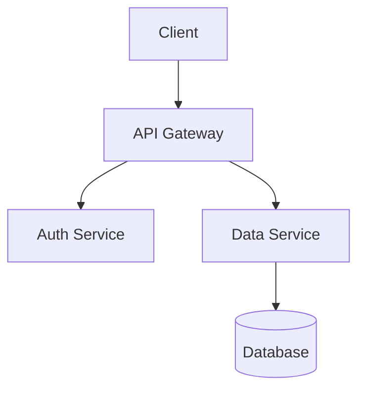
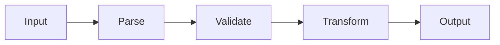
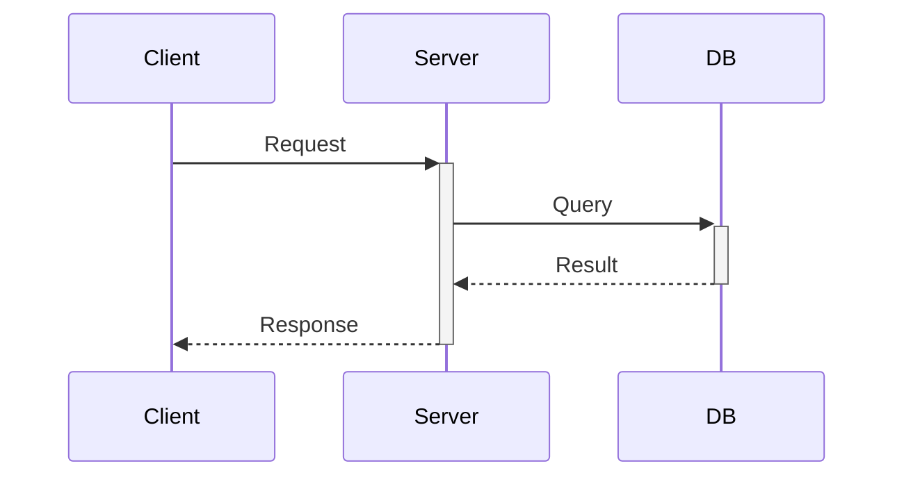

# Mermaid Diagram Patterns

Create diagrams for:
- Architecture (component relationships)
- Data flow (request → response)
- Dependencies (import graph)
- Sequences (step-by-step processes)

## Architecture

## Flow

## Sequence

## When to Use

| Type | Use For |
|------|---------|
| `graph TD` | Component hierarchy, dependencies |
| `flowchart LR` | Data transformation, pipelines |
| `sequenceDiagram` | Request/response, multi-party interaction |
| `classDiagram` | Type relationships, inheritance |
| `stateDiagram` | State machines, lifecycle |

## Tips

- Keep nodes short (3-4 words max)
- Use subgraphs for grouping related components
- Arrow labels for relationship types
- Prefer LR (left-right) for flows, TD (top-down) for hierarchies
