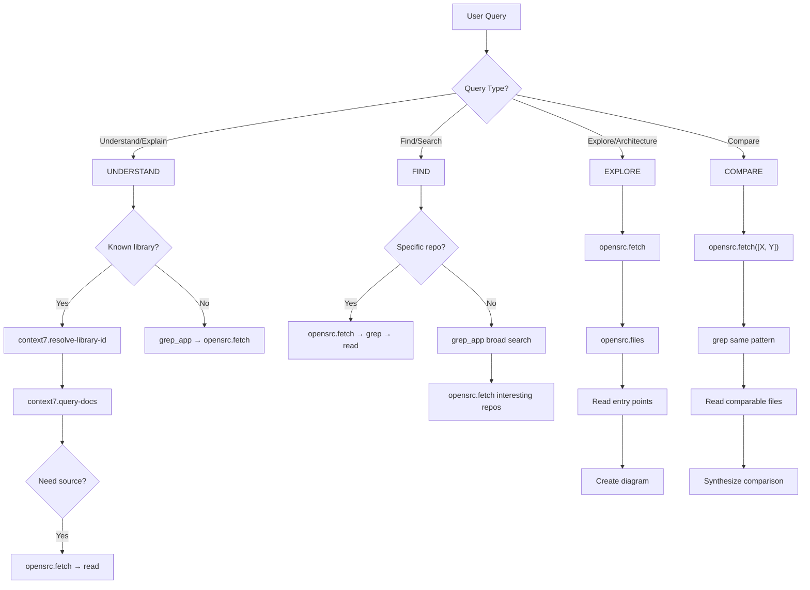

# Tool Routing

## Decision Flowchart



## Query Type Detection

| Keywords | Query Type | Start With |
|----------|------------|------------|
| "how does", "why does", "explain", "purpose of" | UNDERSTAND | context7 |
| "find", "where is", "implementations of", "examples of" | FIND | grep_app |
| "explore", "walk through", "architecture", "structure" | EXPLORE | opensrc |
| "compare", "vs", "difference between" | COMPARE | opensrc |

## UNDERSTAND Queries

```
Known library? → context7.resolve-library-id → context7.query-docs
                 └─ Need source? → opensrc.fetch → read

Unknown?      → grep_app search → opensrc.fetch top result → read
```

**When to transition context7 → opensrc:**
- Need implementation details (not just API docs)
- Question about internals/private methods
- Tracing code flow through library

## FIND Queries

```
Specific repo? → opensrc.fetch → opensrc.grep → read matches

Broad search?  → grep_app → analyze → opensrc.fetch interesting repos
```

**grep_app query tips:**
- Use literal code patterns: `useState(` not "react hooks"
- Filter by language: `language: ["TypeScript"]`
- Narrow by repo: `repo: "vercel/"` for org

## EXPLORE Queries

```
1. opensrc.fetch(target)
2. opensrc.files → understand structure
3. Identify entry points: README, package.json, src/index.*
4. Read entry → internals
5. Create architecture diagram
```

## COMPARE Queries

```
1. opensrc.fetch([X, Y])
2. Extract source.name from each result
3. opensrc.grep same pattern in both
4. Read comparable files
5. Synthesize → comparison table
```

## Tool Capabilities

| Tool | Best For | Not For |
|------|----------|---------|
| **grep_app** | Broad search, unknown scope, finding repos | Semantic queries |
| **context7** | Library APIs, best practices, common patterns | Library internals |
| **opensrc** | Deep exploration, reading internals, tracing flow | Initial discovery |

## Anti-patterns

| Don't | Do |
|-------|-----|
| grep_app for known library docs | context7 first |
| opensrc.fetch before knowing target | grep_app to discover |
| Multiple small reads | opensrc.readMany batch |
| Describe without linking | Link every file ref |
| Text for complex relationships | Mermaid diagram |
| Use tool names in responses | "I'll search..." not "I'll use opensrc" |
